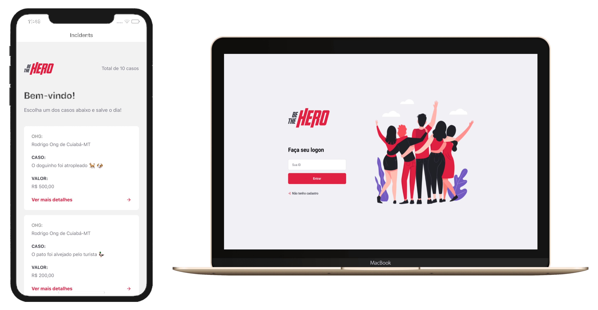

<h1 align="center">
    <!--  -->
        
</h1>

<h4 align="center">
  🚀 Semana OmniStack 11.0
</h4>

  

 

  

## 🚀 Tecnologias

Durante o desenvolvimento desta aplicação foram utilizadas as seguintes tecnologias:

- [Node.js](https://nodejs.org/en/)
- [React](https://reactjs.org)
- [React Native](https://facebook.github.io/react-native/)
- [Expo](https://expo.io/)

## 💻 Projeto

O Be The Hero é uma aplicação que proporciona a qualquer pessoa fazer doações para uma ou várias ONG`s.

O back-end da apliccão foi escrito em Node.Js, o front-end em React.js e o mobile em React-Native.

## 🤔 Como Instalar

- Clone o repositório `https://github.com/rodrigomguerreiro/semana-omnistack-11.0.git`;
- Navegue até o diretório: `cd semana-omnistack-11.0-master/...`;
- Execute: `npm install`;
- Para o Back-end: `npm start`. Disponível em `http://localhost:3333`.
- Para o Front-end: `npm start` para verificar a aplicação em `http://localhost:3000`
- Para o Mobile: `expo start` para verificar a aplicação em `http://localhost:19002/`. Selecione o dispositivo para exibição.

## Seja você o herói agora. =)